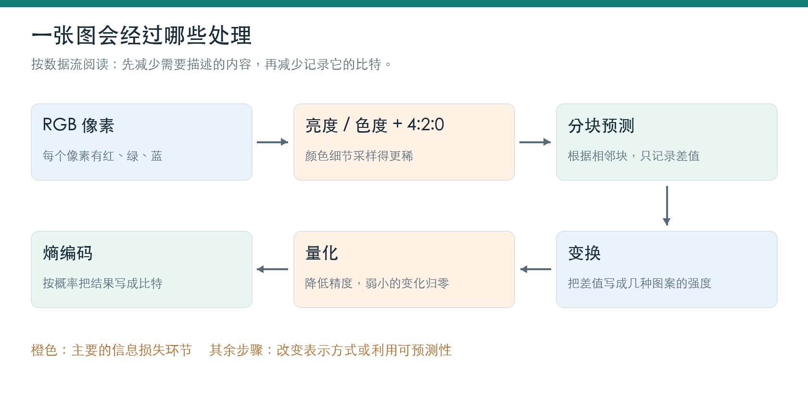
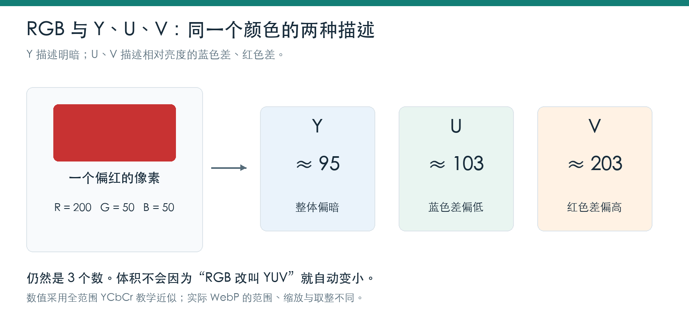
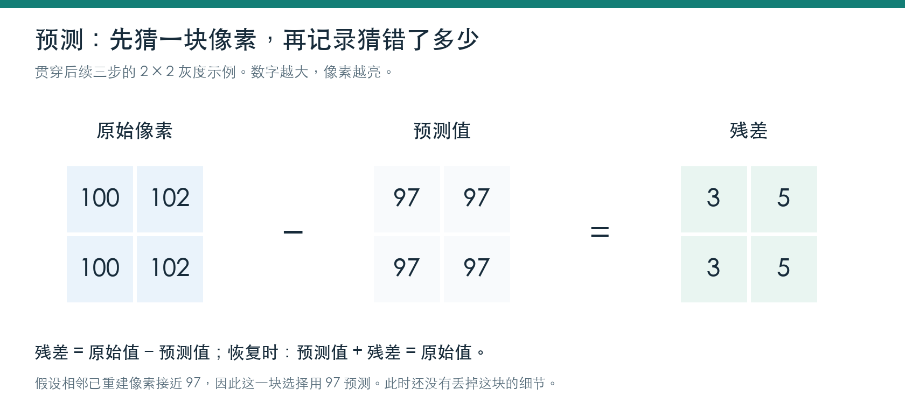
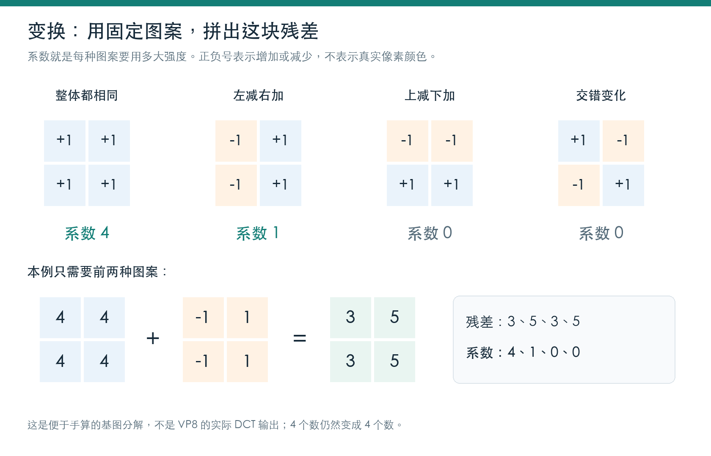
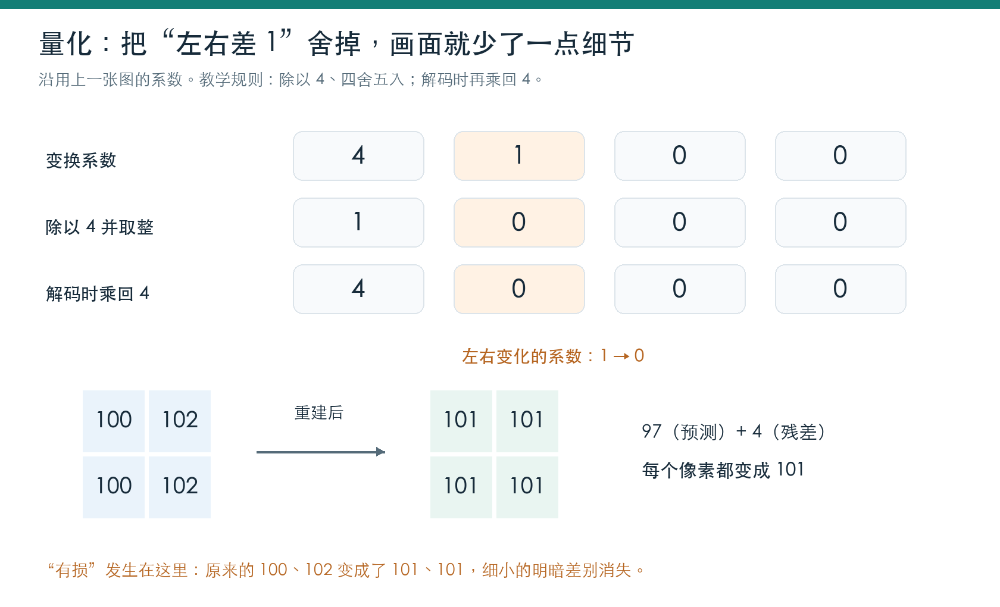
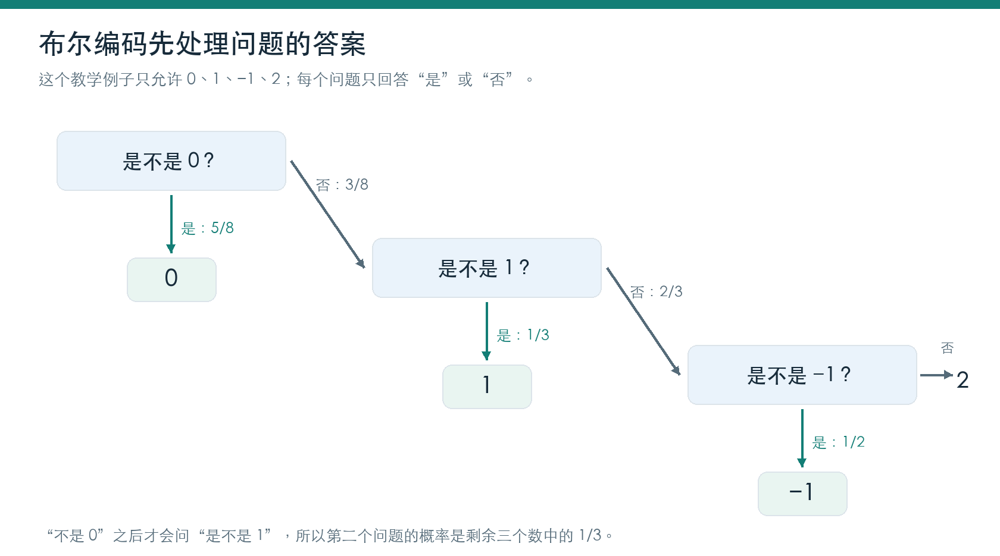
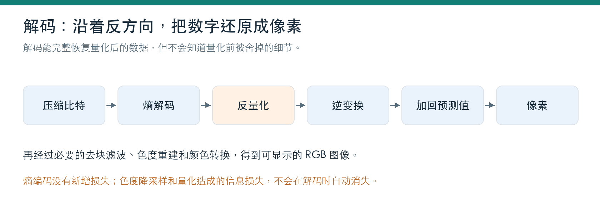
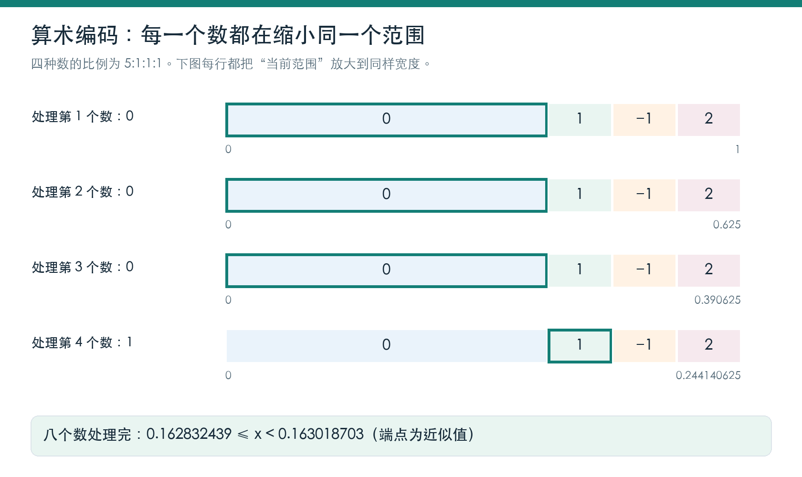

# WebP 有损压缩：从像素到比特

一张照片里，相邻像素往往很像；天空、墙面和皮肤，也不会每隔一个像素就完全换一种颜色。把每个像素独立记下来，会重复记录很多相似的信息。WebP 有损压缩会利用这种规律，再舍掉一部分不容易察觉的细节，让文件变小。

本文只讲静态图片的有损压缩。WebP 也支持无损压缩，但那是另一条编码路径。有损 WebP 的图像数据使用 VP8 关键帧编码，下面按它的处理顺序展开。[[1]](https://developers.google.com/speed/webp/docs/riff_container)

前半篇用一块 2 × 2 像素讲清预测、变换和量化；后半篇再看怎样把结果写成比特。图中较小的矩阵和手算规则用于理解原理，涉及真实格式的差别会在对应位置说明。

## 1. 从像素开始：一张图为什么能压缩

先把图片看成一张方格纸，每个格子就是一个像素。常见的 8 位 RGB 图像，用三个数描述一个像素：R 是红色，G 是绿色，B 是蓝色，每个数都在 0～255 之间。黑色是 (0, 0, 0)，白色是 (255, 255, 255)，三个数相等时是中性灰。

| 颜色 | RGB 数值 |
| --- | --- |
| 黑色 | (0, 0, 0) |
| 深灰色 | (50, 50, 50) |
| 中灰色 | (128, 128, 128) |
| 白色 | (255, 255, 255) |
| 偏红的颜色 | (200, 50, 50) |

一个 bit 只能记录 0 或 1，8 个 bit 是 1 个字节。上述每个通道需要 1 字节，所以一张 1000 × 1000 的 RGB 图片，如果逐像素原样保存，仅颜色数据就要 300 万字节，约 3 MB；这里还没算透明度和文件附加信息。

压缩可以从两处下手：相似的内容尽量少重复记录；不太影响观感的细节允许保留得粗一些。WebP 把这两类办法放在同一条流程中。

**图 1｜WebP 有损压缩的主流程。橙色标出主要的信息损失环节。**



这些步骤通常是顺着执行的：预测产生差值，变换处理差值，量化处理变换系数，熵编码再把结果写进文件。真实编码器还会比较不同预测模式和参数，选择体积与误差之间更合适的方案。

## 2. 先把明暗和颜色分开

RGB 的三个数一起决定一个像素的颜色和明暗。如果希望“明暗细节保留得多，颜色细节保留得少”，直接对 RGB 动手不太方便，因此先换一种描述方式：Y 表示亮度信息，U、V 表示色度信息。数字图像里更严格的名字是 Y′CbCr；本文沿用常见的 Y、U、V 叫法。

U 和 V 不是“另外两种颜色”，而是颜色与亮度之间的差：U 与蓝色差有关，V 与红色差有关。原来的三个数，换算后仍是三个数。

**图 2｜同一个偏红像素，可以写成 RGB，也可以写成亮度加两路色度。**



下面是一组全范围 YCbCr 的教学近似，输入 RGB 都按 0～255 计算：

```text
Y = 0.299R + 0.587G + 0.114BU ≈ 128 + 0.564(B − Y)V ≈ 128 + 0.713(R − Y)
```

先用红、绿、蓝的加权平均算出 Y；再看蓝色与 Y 相差多少、红色与 Y 相差多少。色差可能为负，因此加上 128，把中性色放在中间。对 (200, 50, 50)，算出的结果约为 (95, 103, 203)：整体偏暗，红色差较高。灰色 (128, 128, 128) 则得到 (128, 128, 128)，两路色差都处于中性位置。

绿色信息没有被扔掉。知道 Y、U、V 后，可以先恢复 R 和 B，再由亮度公式求回 G。单纯做这种坐标变换并不会让三个数自动变成更少的数；后面的色度降采样才会减少样本。公式说明见[色彩空间文档](https://www.kernel.org/doc/html/v4.9/media/uapi/v4l/pixfmt-007.html)。实际 WebP 的取值范围、缩放和整数取整与这组教学公式不同，不宜直接拿它实现编码器。

## 3. 4:2:0：少存一些颜色细节

人眼通常更容易察觉明暗边缘的变化，对颜色的细小空间变化相对不那么敏感。因此可以保留较密的亮度样本，把颜色样本存得稀一些。4:2:0 就是一种采样方式：每个像素保留 Y，每个 2 × 2 区域对应一个 U 样本和一个 V 样本。[[2]](https://developer.apple.com/documentation/accelerate/converting-chroma-subsampled-images)

**图 3｜4:2:0 中，U、V 的宽和高都是亮度平面的一半。图表示采样密度。**


为什么叫 4:2:0？用一个宽 4 个像素、高 2 行的参考区域来看：4 表示每行的 4 个亮度样本；2 表示第一行对应 2 组色度样本；0 表示第二行没有新增一行独立色度样本。这里一组色度包含 U 和 V，最后的 0 不是“不保存 V”。

对一个 2 × 2 区域，完整采样需要 4 个 Y、4 个 U、4 个 V，共 12 个数；4:2:0 需要 4 个 Y、1 个 U、1 个 V，共 6 个数。在位深相同、不考虑透明度等信息时，采样数据量减半，但这不意味着最终 WebP 文件一定缩小一半。

图里的“一个样本对应四个位置”是理解密度的方式。实际降采样通常会综合附近像素进行滤波，解码时也可以插值重建，而不是简单取左上角颜色、复制四遍。彩色细字、细线和锐利色彩边界可能因此变糊；这是有损压缩中的一处信息损失。

## 4. 预测：只记录“猜错了多少”

接下来把亮度和色度数据分块处理。很多图像区域是连续的：一块浅灰墙面的旁边，多半还是浅灰墙面。编码器可以利用上方、左侧等已经重建的邻居，预测当前块的像素值。真实 VP8 支持多种预测方向和模式，这里只看最简单的一种。

假设附近像素接近 97，于是把当前块的四个像素都预测成 97。实际值却是左列 100、右列 102。两者相减，就得到残差。

**图 4｜残差是实际值与预测值的差。本例把 100、102 转成了 3、5。**



接收方只要用同样的邻居和预测方式，就能得到同一块预测值。再加上残差，97 + 3 = 100，97 + 5 = 102，原来的值就回来了。因此，预测和作差本身并不要求丢掉信息。编码器还需要记录选择了哪种预测模式。

为什么较小的残差有帮助？如果预测准确，残差经常集中在 0 和几个较小的数附近，后面就更容易利用这种分布节省比特。但“100 变成 3”不等于立刻省空间：如果两者仍然都用固定 8 位存储，占用是一样的。真正如何省 bit，要看最后的编码方式。

编码器要使用和解码器一致的已重建邻居。如果编码器拿原始邻居预测，解码器却只有量化后的邻居，两边的预测值就可能不一致。

## 5. 变换：用几种固定图案拼出残差

现在手里是四个残差：左列 3、右列 5。可以逐个保存这四个数，也可以换一种描述：“整块先填 4，再让左边减 1、右边加 1。”

**图 5｜4 倍的整体图案，加上 1 倍的左右变化图案，就得到 3、5、3、5。**



假设编码器和解码器都提前知道图里的四种固定图案，那么只需记录每种图案的强度。这个强度就是系数。本例的系数为 4、1、0、0：整体强度是 4，左右变化强度是 1，上下变化和交错变化都不需要。

解码时，先把四个格子都填成 4，再按左右变化图案加上 −1、+1，便恢复出左列 3、右列 5。后两项系数为 0，表示它们对这块残差没有贡献，不是把对应像素涂成黑色。

这个例子里，四个残差变成四个系数，数量没有减少，也没有主动丢掉细节。改变的是信息的分布：规律性的变化集中到了少数系数上，其余系数变成了零。对平滑区域，真实变换也经常得到少数较大系数和许多较小或为零的系数；纹理复杂时就未必如此。

真实 VP8 主要对小块残差做整数形式的离散余弦变换（DCT），部分亮度 DC 系数还会涉及 Walsh–Hadamard 变换。可以把 DCT 的基图看成从平缓到密集的明暗波纹。整块不变的那一项叫 DC，其余变化项叫 AC。[[3]](https://datatracker.ietf.org/doc/html/rfc6386#section-14)

图中的 2 × 2 分解是手算模型，不是实际 VP8 DCT 的数值输出。真实 DC 系数与块平均值成比例，比例取决于变换的缩放约定；而这里变换的是残差，所以描述的是平均预测误差，不是原图平均底色。真实整数实现也会涉及舍入。

## 6. 量化：在哪一步真正舍掉细节

变换后的小系数仍然有含义。系数 1 表示确实存在一点左右变化；要精确恢复，就必须保留它。量化则允许把这点变化近似成 0，以减少需要记录的精度。

先给一条方便手算的规则：选步长 4，用系数除以 4，再四舍五入，保存取整后的结果。解码时把结果乘回 4。这相当于只允许用 0、4、8、12 等刻度附近的值来近似原系数。

**图 6｜左右变化系数从 1 变成 0，重建后的四个像素都成为 101。**



| 原系数 | 除以 4 | 保存的整数 | 解码乘回 4 |
| --- | --- | --- | --- |
| 4 | 1 | 1 | 4 |
| 1 | 0.25 | 0 | 0 |
| 0 | 0 | 0 | 0 |
| 0 | 0 | 0 | 0 |

原来的系数 4 可以恢复，系数 1 却只恢复成了 0。逆变换后，残差变成四个 4；加回预测值 97，四个像素都成为 101。原来左边 100、右边 102 的细小差别消失了。

“除以步长”和“乘回步长”不会相互抵消，因为中间做了取整。就像把 23 按十位记录成 2，之后乘 10 只能得到 20，已经不知道它原来是 21、22、23 还是 24。

步长通常越大，保留越粗，更多小系数会归零，也更容易压出较小的文件。代价是细节可能变平、出现块状感或边缘振铃。实际 WebP 会区分不同系数和分段参数，量化规则也比这里的统一四舍五入更复杂；本例只展示精度为什么会丢失。

## 7. 熵编码：把剩下的结果写得更省

到了这一步，数据已经是量化后的系数。熵编码负责给它们换一种更省 bit 的写法，不再主动降低数值精度。这里的“无损”只针对已经量化的数据，并不意味着能找回前面丢掉的像素细节。

先看一组独立的示例数据。它用于说明编码方法，不是上一块 2 × 2 像素的继续计算：

```text
0、0、0、1、0、0、−1、2
```

如果只允许 0、1、−1、2 四种数，固定给每种数分配 2 bit，八个数一共要 16 bit。也可以把常见的 0 写短一些，把少见的数写长一些：

| 数值 | 固定长度写法 | 一种变长写法 |
| --- | --- | --- |
| 0 | 00 | 0 |
| 1 | 01 | 10 |
| −1 | 10 | 110 |
| 2 | 11 | 111 |

这样，五个 0 花 5 bit，1 花 2 bit，−1 和 2 各花 3 bit，总计 13 bit。解码也不会串位：这套规则中，没有任何完整编码是另一个编码的开头。看到 0 就结束一个数；看到 1 就继续读取，直到确定是哪一个数。以上都暂时不计算规则本身的存储成本。

有损 WebP 采用布尔算术编码。它会把系数类别等信息拆成一连串二选一的判断，再根据每次判断的概率联合编码。下面这棵树是为四种数设计的教学版本。[[4]](https://datatracker.ietf.org/doc/html/rfc6386#section-7)

**图 7｜先确定是不是零，再逐步确定剩余数值。每个节点使用自己的条件概率。**



用 0 记“是”、1 记“否”，八个数对应的判断序列就是：

```text
数值：  0  0  0  1   0  0  −1   2判断：  0  0  0  10  0  0  110  111
```

这些 0、1 是输入给布尔编码器的判断结果，还不是最终要逐位写入文件的内容。编码器还知道每个判断有多常见：第一问“是不是 0”的概率为 5/8；在已经确定不是 0 后，“是不是 1”的概率是 1/3；再排除 1 后，“是不是 −1”的概率是 1/2。

算术编码可以想成给整串结果在 0～1 的尺子上找一个位置。每回答一次问题，就把当前范围按概率分成两段，进入对应的一段。常见答案分到较宽的一段，少见答案分到较窄的一段。处理完后，写出足够的二进制位，让解码器定位到最后那个小范围。

解码器使用同样的判断树、概率和结束规则，就能逐个还原答案，再还原八个数。它并不需要事先知道原始序列。如果概率是编码器从这批数据统计出来的，也必须通过格式约定让解码器得到相同模型，不能把这部分成本凭空省掉。完整手算见附录 A。

## 8. 解码后，为什么还能得到一张图

文件里除了压缩后的系数，还会带上重建所需的信息，例如预测模式、量化参数和概率相关信息。解码器先恢复量化后的系数，再反量化、逆变换，得到近似残差；用同样方式计算预测值，加回残差，就得到重建像素。

**图 8｜系数沿反方向变回像素。色度重建与颜色转换后得到可显示图像。**



回到贯穿正文的例子，整条链路可以连起来看：

```text
原始像素：100、102、100、102预测值：   97、 97、 97、 97残差：      3、  5、  3、  5教学变换：  4、  1、  0、  0量化后：    1、  0、  0、  0熵编码 → 文件 → 熵解码恢复系数：  1、  0、  0、  0反量化：    4、  0、  0、  0逆变换：    4、  4、  4、  4加回预测：101、101、101、101
```

恢复出的像素和原始像素很接近，但已经不完全相同。如果把步长选得更细，通常能保留更多差异，文件也可能变大。图片尺寸则可以完全没变：这里的压缩不要求把 1000 × 1000 缩成 500 × 500。

实际 VP8 还会按配置进行去块滤波，用于减轻块边界带来的不自然感。滤波可以改善观感，但无法知道已经丢掉的原始细节究竟是什么。

## 9. 把这些原理放回图片开发

**文件小，不代表解码后的内存也按比例小。** 文件保存的是压缩表达，显示时仍需像素缓冲。以常见的每像素 4 字节 RGBA 缓冲为例，一张 1024 × 1024 的图约占 4 MiB，实际还要看像素格式、行对齐和缓存等因素。

**有损模式的 quality 设到 100，不等于切换到无损。** 有损路径仍有自己的色度采样和编码约束；要逐像素保真，需要使用明确的无损模式。

**不能只看扩展名比较体积。** 原图内容、尺寸、允许的画质损失、透明度和编码器设置都会影响结果。对比 WebP 与 JPEG 时，应尽量对齐尺寸和可接受画质；不能拿低画质 WebP 与高画质 JPEG 比完大小，就把全部收益归给格式。

**文字、细线和照片的取舍不同。** 照片里的一点纹理损失可能不明显，彩色文字边缘的色度误差却更容易被看到。选图像格式和质量参数时，最终仍要看实际素材。

如果只需要解释 WebP 为什么能压得小，可以这样说：它先把明暗和颜色分开，对颜色做较稀疏的采样；再利用相邻像素预测当前块，只编码差值；通过变换把差值的规律集中到少量系数，量化时舍掉部分细微变化；最后按概率把结果写成更少的比特。省下的空间来自这些步骤共同作用。

## 附录 A. 用八个数走完一次算术编码

沿用正文的序列：0、0、0、1、0、0、−1、2。为方便手算，假设双方事先约定四种数的概率分别为 5/8、1/8、1/8、1/8，且知道总共要读八个数。每个节点的条件概率仍是 5/8、1/3、1/2。

把一棵判断树走到底，相当于把当前范围分成四段，长度比例为 5:1:1:1。对初始范围 0～1，这四段是：

| 数值 | 所占范围 |
| --- | --- |
| 0 | [0, 0.625) |
| 1 | [0.625, 0.75) |
| −1 | [0.75, 0.875) |
| 2 | [0.875, 1) |

方括号表示包含左端点，圆括号表示不包含右端点，所以相邻范围不会重叠。后续一直在当前选中的范围里继续分，不会读一个新数就回到初始范围。

**图 9｜每一行都放大当前范围，绿框标出本次数值选中的那段。**



前三个数都是 0，每次保留前 5/8，范围依次变成 [0, 0.625)、[0, 0.390625)、[0, 0.244140625)。第四个数是 1，需要回答两次：先回答“不是 0”，保留后 3/8；再回答“是 1”，在剩余范围里保留前 1/3。

```text
读第四个数之前： [0, 0.244140625)回答“不是 0”： [0.152587890625, 0.244140625)回答“是 1”：   [0.152587890625, 0.18310546875)
```

八个数全部处理完后的范围如下。表中小数四舍五入到 9 位，实际计算保留精确分数：

| 读到第几个数 | 本次数值 | 当前范围（近似） |
| --- | --- | --- |
| 1 | 0 | [0, 0.625000000) |
| 2 | 0 | [0, 0.390625000) |
| 3 | 0 | [0, 0.244140625) |
| 4 | 1 | [0.152587891, 0.183105469) |
| 5 | 0 | [0.152587891, 0.171661377) |
| 6 | 0 | [0.152587891, 0.164508820) |
| 7 | −1 | [0.161528587, 0.163018703) |
| 8 | 2 | [0.162832439, 0.163018703) |

最终范围内的一个可选数是 0.162841796875，它的二进制可以写成 0.0010100110110。采用附录 B 解释的区间前缀约定，可以输出 13 位：

```text
0010100110110
```

接收方把它理解成 0～1 上的位置，再按同样规则检查：它先落在第一个 0 的范围里，再落在第二个 0 的范围里，继续便能读回 0、0、0、1、0、0、−1、2。序列长度由双方已知的八个数确定。

这里的数据部分从固定长度的 16 bit 变成 13 bit，与正文那套变长编码恰好一样长。算术编码并不保证每一条短序列都比变长编码更短；如果再计入概率模型、长度和结束信息，这八个数的总成本也未必更小。

真实 WebP 的系数取值不止这四种，概率还与上下文等信息有关，布尔编码器使用有限精度的整数运算。因此，这 13 位是教学模型的一个合法结果，不是把八个系数送入真实 WebP 后就一定得到的字节。

## 附录 B. 二进制小数，以及为什么示例写了 13 位

十进制小数点后各位的权重是 1/10、1/100、1/1000；二进制则是 1/2、1/4、1/8。把十进制小数转成二进制，可以不断“乘 2，取整数部分，再把剩余小数继续乘 2”。取出的整数一定是 0 或 1，按顺序连起来就是小数位。

| 步骤 | 当前小数乘 2 | 取出的位 | 剩余小数 |
| --- | --- | --- | --- |
| 1 | 0.32568359375 | 0 | 0.32568359375 |
| 2 | 0.6513671875 | 0 | 0.6513671875 |
| 3 | 1.302734375 | 1 | 0.302734375 |
| 4 | 0.60546875 | 0 | 0.60546875 |
| 5 | 1.2109375 | 1 | 0.2109375 |
| 6 | 0.421875 | 0 | 0.421875 |
| 7 | 0.84375 | 0 | 0.84375 |
| 8 | 1.6875 | 1 | 0.6875 |
| 9 | 1.375 | 1 | 0.375 |
| 10 | 0.75 | 0 | 0.75 |
| 11 | 1.5 | 1 | 0.5 |
| 12 | 1 | 1 | 0 |

第 12 步剩余小数成为 0，转换完成：

```text
0.162841796875（十进制）= 0.001010011011（二进制）= 0.0010100110110（二进制，末尾补 0）
```

**精确表示一个数，和用一段前缀定位一个区间，是两件事。** 单纯把这个数写成二进制，12 位已经足够；如果把输出理解成“所有以这些位开头的二进制小数”，12 位和 13 位覆盖的范围就不同：

| 输出前缀 | 它覆盖的所有二进制小数对应的范围 |
| --- | --- |
| 001010011011（12 位） | [0.162841796875, 0.1630859375) |
| 0010100110110（13 位） | [0.162841796875, 0.1629638671875) |

目标范围约为 [0.162832439, 0.163018703)。12 位前缀的右端超过目标范围，13 位前缀则完整落在里面。因此附录 A 采用的前缀约定输出 13 位。换一种明确的终止约定，编码长度的计算也可能不同，不能简单按小数末尾能否删 0 来判断真实编码器的输出。

还有一个常见疑问：是不是十进制最后一位为 5，才能得到有限二进制小数？对非整数，去掉末尾多余的 0 后，能有限表示的确实以 5 结尾；但反过来不成立，例如 0.15 仍会无限循环。准确标准是：化成最简分数后，分母只有因子 2。

| 十进制 | 最简分数 | 能否有限表示 |
| --- | --- | --- |
| 0.125 | 1/8 = 1/2³ | 能 |
| 0.15 | 3/20，分母还含因子 5 | 不能 |
| 0.162841796875 | 667/4096 = 667/2¹² | 能，用 12 位精确表示 |

## 参考资料

文中的像素矩阵、系数分解和算术编码数值为教学示例；真实格式细节以规范和实现为准。

[[1] Google：WebP Container Specification](https://developers.google.com/speed/webp/docs/riff_container)。用于区分有损 VP8 与无损 VP8L，以及颜色转换约定。

[[2] Apple：Converting chroma-subsampled images](https://developer.apple.com/documentation/accelerate/converting-chroma-subsampled-images)。解释亮度、色度与 4:2:0 的采样关系。

[[3] RFC 6386，第 14 节](https://datatracker.ietf.org/doc/html/rfc6386#section-14)。反量化、DCT / WHT 和块重建。

[[4] RFC 6386，第 7～8 节](https://datatracker.ietf.org/doc/html/rfc6386#section-7)。布尔算术编码原理和树编码；第 12～13 节介绍预测与系数解码。

[[5] Linux Kernel：Detailed Colorspace Descriptions](https://www.kernel.org/doc/html/v4.9/media/uapi/v4l/pixfmt-007.html)。Y′CbCr 的系数与全范围 / 有限范围定义。

[[6] Google：WebP Compression Techniques](https://developers.google.com/speed/webp/docs/compression)。WebP 压缩技术概览。

[[7] MDN：Chroma subsampling](https://developer.mozilla.org/en-US/docs/Web/Media/Guides/Formats/Video_concepts#chroma_subsampling)。4:2:0 的记法与采样密度示意。

